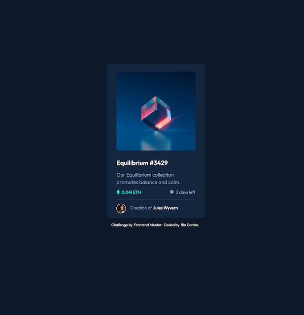

# Frontend Mentor - NFT preview card component solution

This is a solution to the [NFT preview card component challenge on Frontend Mentor](https://www.frontendmentor.io/challenges/nft-preview-card-component-SbdUL_w0U). Frontend Mentor challenges help you improve your coding skills by building realistic projects. 

## Table of contents

- [Overview](#overview)
  - [The challenge](#the-challenge)
  - [Screenshot](#screenshot)
  - [Links](#links)
- [My process](#my-process)
  - [Built with](#built-with)
  - [What I learned](#what-i-learned)
  - [Continued development](#continued-development)
  - [Useful resources](#useful-resources)
- [Author](#author)


## Overview

### The challenge

Users should be able to:

- View the optimal layout depending on their device's screen size
- See hover states for interactive elements

### Screenshot



### Links

- Solution URL: [https://github.com/RioCantre/nft-preview-card](https://github.com/RioCantre/nft-preview-card)
- Live Site URL: [https://nft-preview-card-project.netlify.app/](https://nft-preview-card-project.netlify.app/)

## My process

### Built with

- Semantic HTML5 markup
- CSS custom properties
- Flexbox
- Mobile-first workflow
- [React](https://reactjs.org/) - JS library

### What I learned

I learned how to add another layer on hover state of an image. I structured first the HTML elements and use CSS styling to accomplish the ideal design. 

See the code snippets below:

```html
    <div className="hero-image">
    
        <div className="image-hover">
            
        </div>
    </div>
```

```css
.image-hover {
    background: hsla(178, 100%, 50%, 0.5);
    width: 278px;
    height: 278px;
    transition: .5s ease;
    opacity: 0;
    position: absolute;
    top: 37.8%;
    left: 50%;
    transform: translate(-50%, -50%);
    -ms-transform: translate(-50%, -50%);
    text-align: center;
    border-radius: 8px;
    
}
```


### Continued development

In this project I would like to improve more on styling the hover state of the hero image,the placement of the components and perfect height of the container. I struggled with the actual position of the card since I'm using a small screen. 


### Useful resources

- [W3schools](https://www.w3schools.com/howto/tryit.asp?filename=tryhow_css_image_overlay_opacity) - This help me solved the hover state of the hero image. I used this example and applied it on CSS style.

## Author

- Website - [Rio Cantre](https://riocantre.netlify.app/)
- Frontend Mentor - [@RioCantre](https://www.frontendmentor.io/profile/RioCantre)
- Twitter - [@CantreRio](https://twitter.com/CantreRio)


